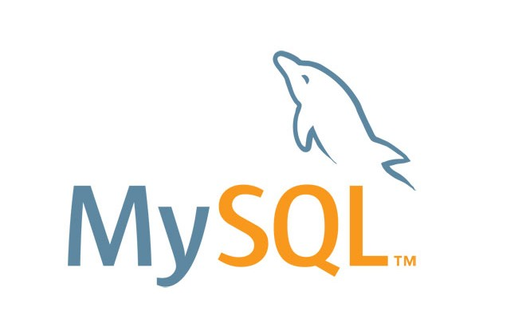

# MySQL SERVER

imagen de mysql server

## ACCESOS

* **user**: leafnoise
* **pass**: leafnoise
* **puerto**: 3306
* **BD de ejemplo**: database
* **user root**: root
* **pass root**: leafnoise

## VOLUMES

* **data**: con los datos guardados por la base de datos
* **sql**: guardado dentro del docker en "/volumes/sql/" sirve para agregar scripts sql

## PAGINA

https://hub.docker.com/_/mysql