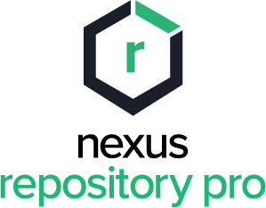

# nexus3

> Imagen de nexus3

## Puertos

* **8081**: para la consola, se entra accediendo a http://localhost:8081/nexus3/

## Accesos

* **user**: admin

La pass se guarda en `/data/admin.password` y al loguearse pide cambiarla, se le puede poner *admin*

## Volumes

* **data**: datos de nexus3

## Paginas

[Imagen docker hub](https://hub.docker.com/r/sonatype/nexus3/)
[Pagina oficial](https://www.sonatype.com/product-nexus3-repository)
