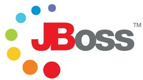

# JBOSS EAP 7.1

Imagen con un jboss eap 7.1 alphine

## PUERTOS

* **consola**: 9990
* **debug**: 7080

* **puertos expuestos para despliegues**: del 7000 al 10000

## ACCESOS CONSOLA

* **user**: leafnoise
* **pass**: leafnoise

## VOLUMES

* **dependencias**: carpeta donde irian todos los archivos que necesites en el docker
* **log**: logs del server
* **deployments**: carpeta de despliegue para el standalone

## CONFIGURACION

en el archivo **.env** se encuentras las variables de ambiente para configurar el jboss

## SCRIPTS

Se tienen que correr desde la raiz del proyecto, ejemplo:
`./scripts/jboss-cli.sh`

* **jboss-cli**: ejecuta el script de *bin/jboss-cli.sh*, una vez dentro connectarse con el comando *connect*  

## PAGINA

[daggerok/jboss-eap-7.1](https://hub.docker.com/r/daggerok/jboss-eap-7.1)
